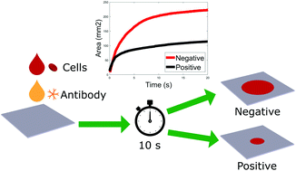

```{r setup, include=FALSE}
knitr::opts_chunk$set(echo = TRUE)
library(leaflet)
library(dplyr)
library (s20x)
library(ggplot2)
```

<center>

{ width=20% }

</center>

# Introduction
In the 2010 study, *Analytical Chemistry*, medical researchers developed a new method of typing blood. These researchers discovered that when applying blood drops to lost cost paper, they could determine ABO blood typing through the presence (or lack thereof) of antibodies. 

<center>
. (a) AB+ blood interact with antibody-A on paper and create separate layer of RBC and serum, (b) B+ blood wick on paper without any distinctive separation."){ width=20% }

[@khan2012]
</center>


This was a major breakthrough because the leading method of blood typing (gel column agglutination) is much more costly and time consuming. Researchers in the article *A rapid paper-based blood typing method from droplet wicking* discovered that this method was more cost effective and extremely scalable [@hertaeg2021]. 

## My Interest in the Data

I am specifically interested in this data because I believe that if we can a cost effective way of determining blood type, we can apply this to anemic diseases such as sickle cell anemia and provide an at-home kit for at-risk individuals to use. 

<center>
{ width=20% }

[@hertaeg2021]
</center>

## The Data


Chemical engineers conducted a study in Analytical Chemistry in May 2010, where they experimented with a low-cost paper method for blood typing. The experiment involved measuring the rate of absorption, also known as blood wicking, by applying blood drops on the paper. The wicking lengths in millimeters for six blood drops, each with varying antibody concentrations, are provided in the table [@mendenhall2016.

```{r}
blood = read.csv("BLOODTYPE.csv", header = TRUE)
head(blood)
```

## The Problem to be Solved

I will perform statistical analysis of the data provided to show the effectiveness of wicking as a method of ABO blood typing. Success of this analysis will provide basis of more research into the effectiveness of testing for sickle cell anemia with the same method.

## Preliminary Plots

```{r}
pairs20x(blood)

g=ggplot(blood, aes(x=AB.Conc,y=WickingLength,colour=AB.Conc))
g=g+geom_point() + geom_line()+ geom_smooth(method="lm")
g+ggtitle("Antibody Concentration Vs Wicking Length")
```

### Interpretation

The preliminary plots show that when the antibody concentration is rises, the wicking distance decreases. The abline shows that the decline is somewhat uniform and linear, we will further analyze the truth of this and the nature of the relationship.

# Theory behind the Analysis

## Finding the Equation

I believe that the value of Wicking Length (Y) tends to linearly decrease as the Antibody Concentration (X). I wish to design a model relating the two variables by drawing a line through all points. For this we will define the Y-value, wicking length, as dependent and the Antibody concentration as the independent variable.

Because the points in the graph are not perfectly aligned, as shown in the preliminary graphs. From this, we will need to use a probabilistic model as the model will be more accurate for this data set. The specific model we will use is the simple linear regression model (SLR). The Simple Linear Regression (SLR) model makes an assumption that when the y data is plotted against the x data, the mean value for any given x will form a straight line. Any deviations from this straight line, whether above or below it, are considered to be equal to ϵ. This statement is as follows:

<center>
$y = \beta_0 + \beta_1x_i+\epsilon_i$
</center>

In this statement, $\beta_0$ and $\beta_1$ are unknown. $\beta_0 + \beta_1x$ is the mean value of y when x is given and $\epsilon$ is the random error. Assuming that certain points will deviate from the straight line, it is expected that some deviations will be positive (above the line) and some will be negative (below the line), while the expected value of the error term (ε) is zero. Consequently, the mean value of y can be obtained as defined below.
$$
E(y) = E(\beta_0 + \beta_1x_i+\epsilon_i)\\
=\beta_0 + \beta_1x_i+E(\epsilon_i)\\
= \beta_0 + \beta_1x_i
$$

Therefore, the mean value of y for any given x will be represented as E(Y|x), plotting as a straight line. The y-intercept in this case will be $\beta_0$ with a slope of $\beta_1$.
To fit a Simple Linear Regression (SLR) model to a given dataset, it is necessary to estimate the values of the parameters β0 and β1. The validity of these estimates depends on the sampling distributions of the estimators, which are in turn influenced by the probability distribution of ε. Therefore, the following assumptions about ε, as stated by Mendenhall and Sincich in 2016, need to be made:

1. The mean of the probability distribution of ε is zero.

2. The variance of the probability distribution of ε is constant for all values of the independent variable. In the case of a straight line model, this means that V(ε) remains constant for all values of x.

3. The probability distribution of ε is normal.

4. The errors associated with different observations are independent of each other.

## Estimation of Parameters

To estimate the slope and y-intercepts we will need to use the method of least squares. This means we will have to determine the line that best fits the data points in the preliminary graphs with the minimum sum of squares of the deviations, called the sume of square for error (or *SSE*). The estimator will be a variation of the straight line model, $\hat{y_i} = \hat{\beta_0} + \hat{\beta_1}x_i$. The residual is the deviation of the *i*th value of y from its predicted value. This is calculated as follows, $y_i-\hat{y_i} = y_i - (\hat{\beta_0} + \hat{\beta_1}x_i)$. Following the sum of squares for error is $\displaystyle\sum_{i = 1}^{n}[y_i - (\hat{\beta_0} + \hat{\beta_1}x_i)]$

## Method of Least Squares

```{r}
blood.lm = lm(WickingLength~AB.Conc, data=blood)
summary(blood.lm)
```

From this summary of blood.lm we can see that $\hat\beta_0 = 19.393$ and $\hat{\beta_1} = -8.036$

We will also use the multiple and adjusted R-squared values later in the analysis for comparing models and finding the line of best fit.

## Confidence Intervals

```{r}
ciReg(blood.lm, conf.level=0.95)
```

## Least Squares Estimate

The least- squares estimate of our slope ($\hat\beta_1 = -8.036$) indicates that when the antibody concentration is increased by 0.1, the wicking distance decreases by just over 8mm. The function is shown below

<center>
$\hat\beta_0 + \hat\beta_1x_i = 19.393 - 8.036 * x_i$
</center>

# Verification of Assumptions

We will now demonstrate whether or not a straight line is the best fit for our data. To do this we will verify the correctness of the above assumptions

```{r}
plot(WickingLength~AB.Conc, bg="coral", pch=21, cex=1.2, ylim=c(0, 1.1*max(WickingLength)), xlim=c(0, 1.1*max(AB.Conc)), main="Scatter Plot and Fitted Line for Wicking Length v. Antibody Concentration", data=blood)
abline(blood.lm)
```

We can see that the line looks to fit the spread of data well but we can perform more calculations to solidify the correctness.

## Plot of Residuals

By plotting the residual line segments, which represent the deviations about the fitted line, we can visually observe how much the data points differ from the line being fitted. This technique also helps us to calculate the Residual Sum of Squares (RSS), which is further utilized to determine the R2 value of the line that we are fitting to the dataset.

```{r}
plot(WickingLength~AB.Conc, bg="coral", pch=21, cex=1.2, ylim=c(0, 1.1*max(WickingLength)), xlim=c(0, 1.1*max(AB.Conc)), main="Residual Line Segments of Wicking Length v. Antibody Concentration", data=blood)

ht.lm = with(blood, lm(WickingLength~AB.Conc))
abline(ht.lm)
yhat=with(blood, predict(ht.lm, data.frame(AB.Conc)))
with(blood, {segments(AB.Conc,WickingLength,AB.Conc,yhat)})
abline(ht.lm)
```

## Plot of Means


To depict the distinction between the means of Wicking Length and Antibody Concentration data, we can plot the average of Wicking Length removed against the average of Antibody Concentration added, along with the fitted line and the deviations of the fitted line from the mean height added. This graphical representation enables us to calculate the Model Sum of Squares (MSS), which will be used along with the RSS in subsequent steps.

```{r}
plot(WickingLength~AB.Conc,bg="coral",pch=21,cex=1.2,
             ylim=c(0,1.1*max(WickingLength)),xlim=c(0,1.1*max(AB.Conc)),
             main="Mean of Wicking Length v. Antibody Concentration", data=blood)
abline(blood.lm)
with(blood, abline(h=mean(WickingLength)))
abline(blood.lm)
with(blood, segments(AB.Conc,mean(WickingLength),AB.Conc,yhat,col="purple"))
```

## Plot of Means with Total Deviation

By graphing the mean of Wicking Length removed against the mean of Antibody Concentration added and including the total deviation line segments, we can visually represent $\hat{y}=\bar{y}$ , where $\hat{y}$ is the estimated value and $\bar{y}$ is the mean value. This graphical representation also helps us to calculate the Total Sum of Squares (TSS).

```{r}
plot(WickingLength~AB.Conc, bg="coral", pch=21, cex=1.2, ylim=c(0, 1.1*max(WickingLength)), xlim=c(0, 1.1*max(AB.Conc)), main="Total Deviation Line Segments of Wicking Length v. Antibody Concentration", data=blood)
with(blood, abline(h=mean(WickingLength)))
with(blood, segments(AB.Conc, WickingLength, AB.Conc, mean(WickingLength), col="deeppink"))

```

### Using RSS, MSS, and TSS values

```{r}
RSS=with(blood,sum((WickingLength-yhat)^2))
print(RSS)
MSS=with(blood,sum((yhat-mean(WickingLength))^2))
MSS
TSS=with(blood,sum((WickingLength-mean(WickingLength))^2))
TSS
```

$R^2$ is equal to MSS/TSS, which means that this value is the value for the trendline and the closer $R^2$ is to 1, the better the fit of the trendline.

```{r}
MSS/TSS
```

A fit of .66 isn't ideal but will work for our data since we only have 6 data points.

## Probability

```{r}
trendscatter(WickingLength~AB.Conc, f = 0.9, data = blood, main="Wicking Length v. Antibody Concentration")
```

The red lines depict the region of error where the line of best fit could be found. We see a somewhat narror region of error for the data provided and a generally linear trend for the line.

Linear Model:

```{r}
blood.lm = with(blood, lm(WickingLength~AB.Conc))
```

Residuals:

```{r}
height.res = residuals(blood.lm)
```

Fitted Values:

```{r}
height.fit = fitted(blood.lm)
```

## Residuals v Antibody Concentration

```{r}
plot(blood$AB.Conc, height.res, xlab="Antibody Concentration", ylab = "Residuals", ylim=c(-1.5*max(height.res),1.5*max(height.res)),xlim=c(0,1.6*max(height.fit)), main="Residuals vs Antibody Concentration")
```

Since the residuals appear somewhat symmetrical about the y value of zero, there is no significant deviation from the line of best fit.

## Residuals v. Fitted Values

```{r}
trendscatter(height.res~height.fit, f = 0.9, data = blood.lm, xlab="Fitted Values",ylab="Residuals",ylim=c(-1.1*max(height.res),1.1*max(height.res)),xlim=c(0,1.1*max(height.fit)), main="Residuals vs Fitted Values")
```

We see a little deviation from symmetricality but this shouldnt produce any errors.

## Normality:

```{r}
normcheck(blood.lm, shapiro.wilk=TRUE)
```

With a p-value of .93 we cannot reject the null hypothesis at a significance level of 0.05 so we can conclude that the data is normally distributed.

## Testing a Different Model for Comparison

While this model looks promising we still should test another model to see if there is a better fit. We will test the results against a quadratic curve.

### Fitting the Quadratic

$ y_i = \beta_0 + \beta_1x_i+\beta_2x_i^2$

```{r}
quad.lm=lm(WickingLength~AB.Conc + I(AB.Conc^2),data=blood)

plot(WickingLength~AB.Conc,bg="coral",pch=21,cex=1.2,
   ylim=c(0,1.1*max(WickingLength)),xlim=c(0,1.1*max(AB.Conc)),main="Scatter Plot and Quadratic of Wicking Length vs Antibody Concentration",data=blood)
myplot = function(x){quad.lm$coef[1] + quad.lm$coef[2]*x + quad.lm$coef[3]*x^2}
curve(myplot, lwd = 2, add = TRUE)
```

Fitting a quadratic curve to the data does produce a curve with our data points, we will further test this to see if we should switch to a quadratic.

### Plot of the Residuals v. Fitted
```{r}
quad.fit = c(height.fit)

plot(quad.lm, which = 1)
```

For this plot we can see there is nearly no symmetry about y = 0. We will continue by checking normality

### Normality:

```{r}
normcheck(quad.lm, shapiro.wilk = TRUE)
```

The p-value is 0.04, leading us to believe that this is not normally distributed. 

## Summarizing Model

```{r}
summary(quad.lm)
```

Given this summary we have our values:
$\beta_0 = 21.491$
$\beta_1 = -23.772$
$\beta_2 = 15.737$

Using these values against the linear model we can determine whether the linear or quadratic models fir the data better.

## Calculating confidence interval

```{r}
ciReg(quad.lm, conf.level = 0.95)
```

## Comparison of Two Models

### Making Predictions using Each Model

I want to predict the Wicking Distance when the antibody concentration is 25%, 50%, and 75%

#### Model 1:

```{r}
amount = predict(blood.lm, data.frame(AB.Conc=c(.25, .5, .75)))
amount
```

#### Model 2:

```{r}
amount2 = predict(quad.lm, data.frame(AB.Conc=c(.25, .5, .75)))
amount2
```

The values predicted are slightly smaller in the quadratic model but are only off by 2mm at the most and average at about .8mm difference. We will need to make further comparisons.

## Comparing R Values

The multiple $R^2$ and Adjusted $R^2$ for both models are as follows

Linear: 

- Multiple: 0.67

- Adjusted: 0.5874

Quadratic: 

- Multiple: 0.8892

- Adjusted: 0.8153

The variablility in the predictions are shown when you examine the $R^2$'s for each model. If a new term added to a model improves it in a significant manner, the adjusted R2 value will increase. On the other hand, if the new term has a less significant impact on the model, the adjusted R2 value will decrease. This means that the adjusted R2 value changes proportionally to the degree of improvement the new term brings to the model, as explained by Frost in 2013. So by seeing that the adjusted $R^2$ increases in the quadratic function, that is the better function for our analysis.

## Using Anova for Confirmation of this conclusion

```{r}
anova(blood.lm, quad.lm)
```

Since our p-value is 0.0927919 we can maintain our null hypothesis and conclude that both models are equally good fits to our data and when referring to the other data when testing the two models we will go forward using the SLR model.

# Using Cooks Distance to Avoid Biases


To ensure the accuracy of our regression analysis and avoid biased conclusions, we should take into account any outliers that might skew the data. Cook’s distance can help us identify such outliers and their influence on the dataset. This statistical measure estimates the impact of removing any particular data point on the least-squares regression analysis being performed. A high Cook’s distance value indicates that the point has a substantial influence on the regression and may need closer inspection to verify the validity of the data. By examining outliers and their contribution to the data set, we can make a more informed decision about the suitability of our regression model [@heiberger_2017].

```{r}
cooks20x(blood.lm)
```

From this we can see that the samples with observation numbers 1, 3, and 6 are considered significant because of their cooks distance and need to be examined closer.
To do this we can create a new linear model without observation number 1. We can summarize both linear models and compare their differences

```{r}
cookblood.lm = lm(WickingLength~AB.Conc, data=blood[-1,])
summary(cookblood.lm)
summary(blood.lm)
```

This shows that the error in our slope is much lower with an error of 1.289 vs 2.820

# Conclusion

The method for blood typing using lost cost paper is a great breakthrough in medical practice. This low-cost paper method for blood typing has several advantages that make it a valuable addition to medical practice. Firstly, the wicking length for ABO blood typing provides a simple and easy-to-use alternative to traditional blood typing methods, which often require expensive equipment and trained personnel. Moreover, the wicking length method is quick and efficient, providing accurate results in a matter of minutes. This makes it particularly useful in emergency situations where time is of the essence. Additionally, the use of low-cost paper makes this method accessible to a wider range of healthcare settings, including resource-limited areas and developing countries. Overall, the wicking length method for ABO blood typing is a significant step forward in medical practice, providing an affordable, rapid, and accessible alternative to traditional blood typing methods.

## Did we answer the question

In our study, we aimed to investigate whether wicking length could be used as a reliable method for determining ABO blood type. To establish this relationship, we analyzed data from six blood samples with varying antibody concentrations. Through our statistical analysis using SLR and Quadratic models, we found that SLR provides a better fit for data relating to wicking distance and antibody concentration. Our results showed a clear negative correlation between antibody concentration and wicking length, indicating that as the number of antibodies increases in the blood sample, the wicking length decreases. These findings suggest that the method of using wicking length for ABO blood typing has potential as a cost-effective and efficient alternative to traditional methods.

## Going Forward

The addition of more data would increase the power of the statistical analysis, potentially reducing the effect of random errors and providing a more accurate representation of the relationship between antibody concentration and wicking length. Additionally, a larger sample size would allow for a more comprehensive examination of potential outliers and a more robust assessment of the overall validity of the assumptions made in the model.

# References

